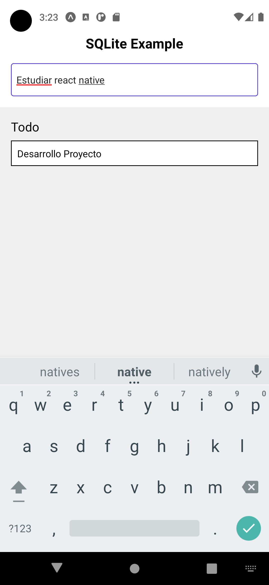
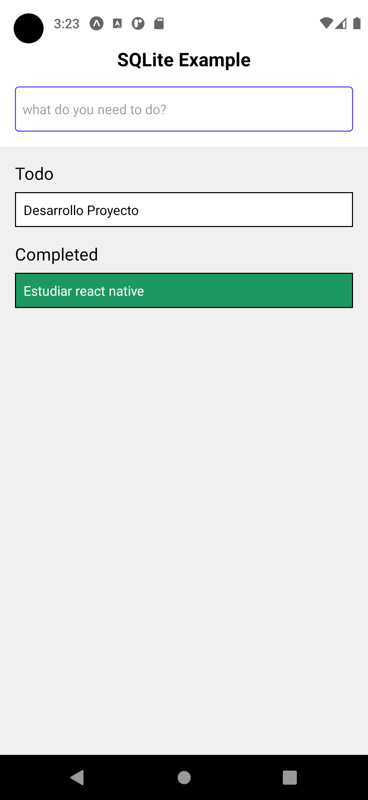
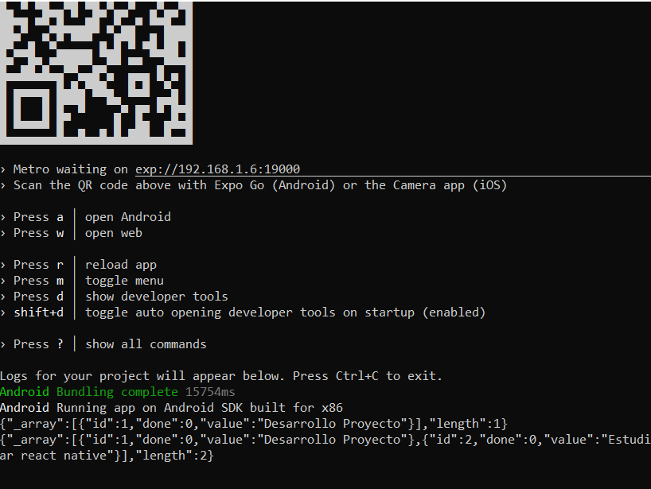

# Desarrollo de la Actividad 8

Nombre: Guillermo Echagüe


## Instalar Expo en Local

Primero instalamos con npm explo-cli y exp (debemos de tener Node.js y npm instalados)
```bash
npm install -g expo-cli exp
```


## Inicio de proyecto
```bash
expo init sqlite
```

To run your project, navigate to the directory and run one of the following yarn commands.

```bash
- cd sqlite
- yarn start # you can open iOS, Android, or web from here, or run them directly with the commands below.
- yarn android
- yarn ios # requires an iOS device or macOS for access to an iOS simulator
- yarn web
```

## Dependencias del proyecto
```bash
yarn add expo-sqlite@~7.0.0
expo install expo-constants
```

### Funciones de App


### Agregar tarea App


### Tarea Realizada App


### Consola de la App



